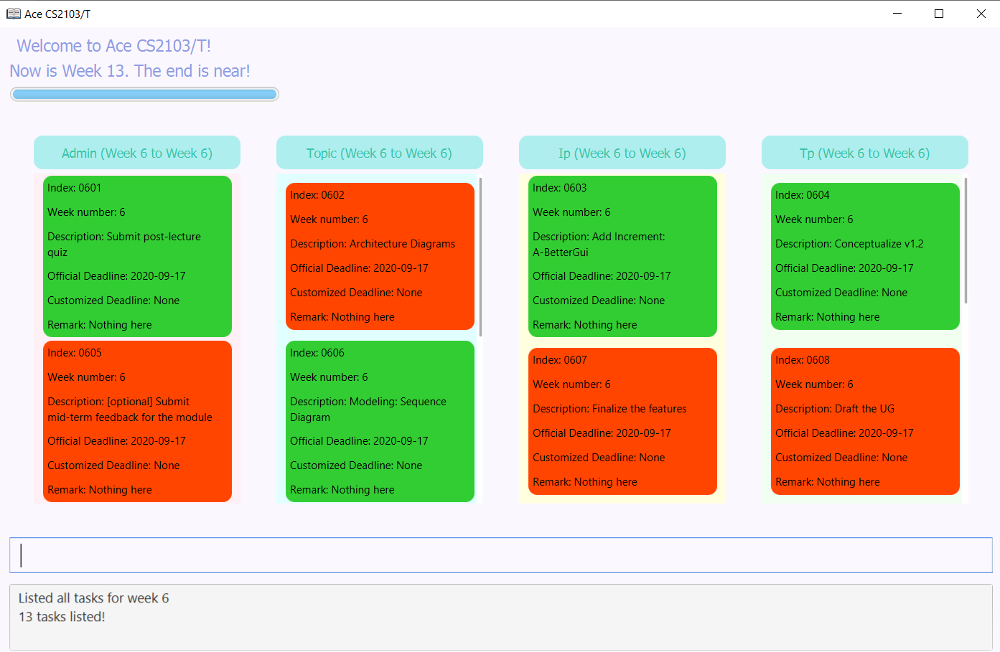
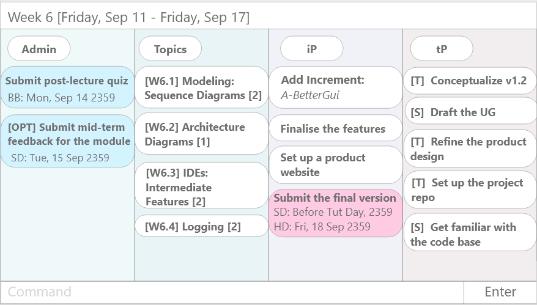

Ace CS2103/T helps CS2103/T students manage their tasks. It is optimized for CLI users so that each task can be managed faster by typing in commands.

Ace CS2103/T is a **desktop app for managing task requirements of CS2103/T, optimized for use via Command Line Interface** (CLI) while still having the benefits of a Graphical User Interface (GUI). If you can type fast, Ace CS2103/T can get your learning tasks managed faster than traditional GUI apps.
* If you are interested in using Ace CS2103/T, head over to the [_Quick Start_ section of the **User Guide**](https://ay2021s1-cs2103-t14-4.github.io/tp/UserGuide.html#quick-start).
* If you are interested about developing Ace CS2103/T, the [**Developer Guide**](https://ay2021s1-cs2103-t14-4.github.io/tp/DeveloperGuide.html) is a good place to start.

**Documentation**
* [Homepage](https://ay2021s1-cs2103-t14-4.github.io/tp/)
* [AboutUs](https://ay2021s1-cs2103-t14-4.github.io/tp/AboutUs.html)
* [UserGuide](https://ay2021s1-cs2103-t14-4.github.io/tp/UserGuide.html)
* [DeveloperGuide](https://ay2021s1-cs2103-t14-4.github.io/tp/DeveloperGuide.html)

**Acknowledgements**
* This project is based on the AddressBook-Level3 project created by the [SE-EDU initiative](https://se-education.org).
