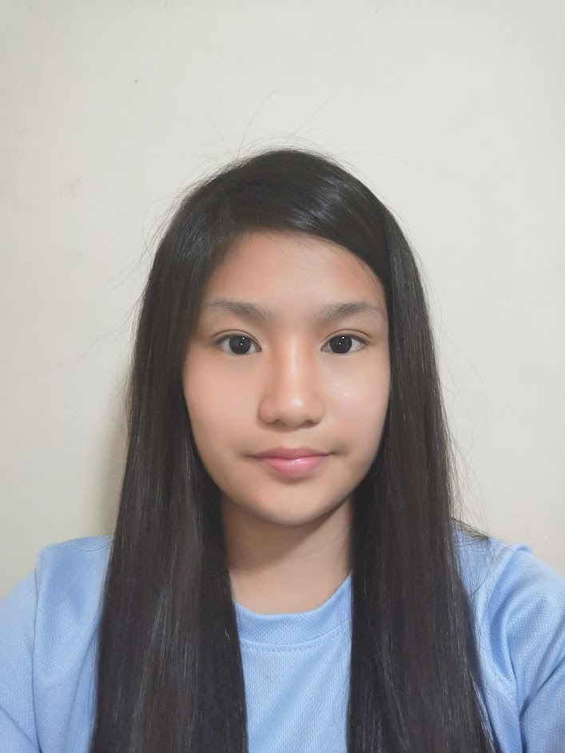
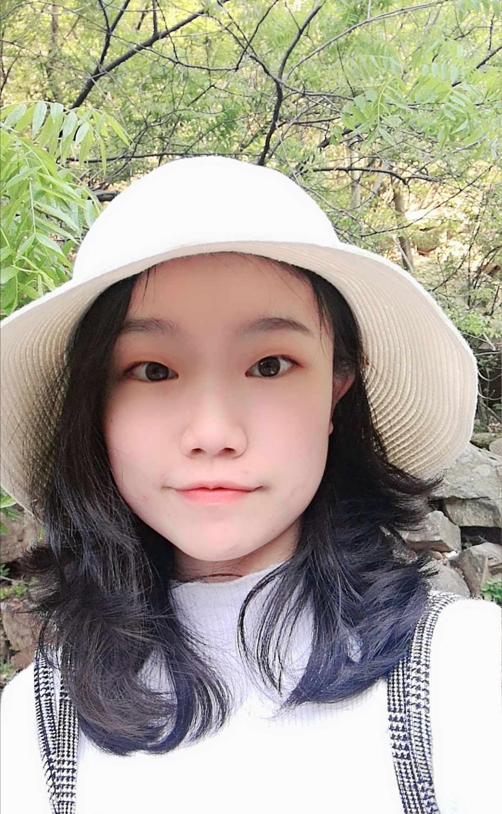

We are a team based in the [School of Computing, National University of Singapore](http://www.comp.nus.edu.sg).

You can reach us at the email `seer[at]comp.nus.edu.sg`

## Project team

### Gao Gui

[[github](https://github.com/Perpetual09)]
[[portfolio](https://ay2021s1-cs2103-t14-4.github.io/tp/team/perpetual09.html)]

* Role: Developer

### Jin Yuze

[[github](https://github.com/UnicornJin)]
[[portfolio](https://ay2021s1-cs2103-t14-4.github.io/tp/team/unicornjin.html)]

### Ong Li Jin

[[github](https://github.com/onglijin)]
[[portfolio](https://ay2021s1-cs2103-t14-4.github.io/tp/team/onglijin.html)]

* Role: Developer

### Xia Liyi

[[github](http://github.com/xia-liyi)]
[[portfolio](https://ay2021s1-cs2103-t14-4.github.io/tp/team/xia-liyi.html)]

* Role: Developer

### Zhang Yunjie

[[github](http://github.com/zhang-yunjie)]
[[portfolio](https://ay2021s1-cs2103-t14-4.github.io/tp/team/zhang-yunjie.html)]

* Role: Developer
