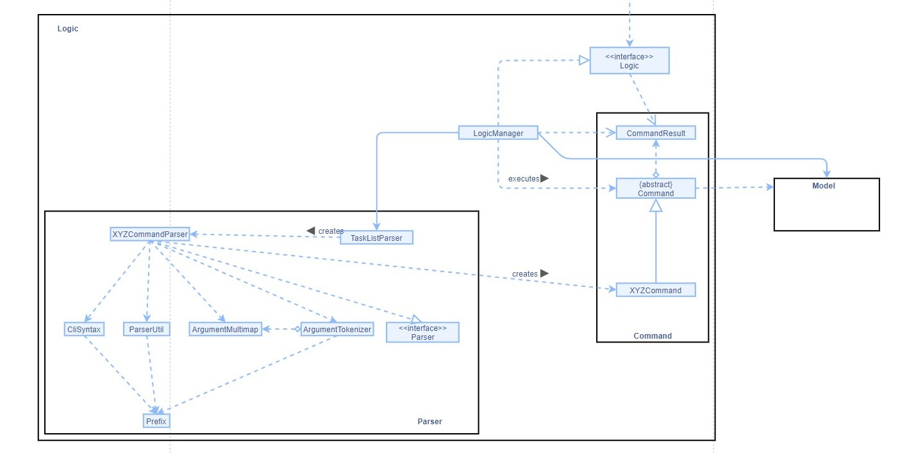
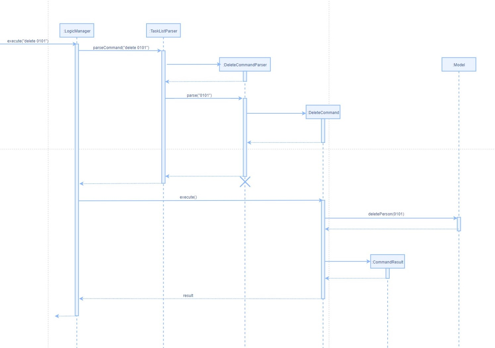

* Table of Contents
{:toc}

--------------------------------------------------------------------------------------------------------------------

## **Setting up, getting started**

Refer to the guide [_Setting up and getting started_](SettingUp.md).

--------------------------------------------------------------------------------------------------------------------

## **Design**

### Architecture

The ***Architecture Diagram*** given above explains the high-level design of the App. Given below is a quick overview of each component.

**`Main`** has two classes called [`Main`](https://github.com/AY2021S1-CS2103-T14-4/tp/blob/master/src/main/java/tp/acecs2103/Main.java) and [`MainApp`](https://github.com/AY2021S1-CS2103-T14-4/tp/blob/master/src/main/java/tp/acecs2103/MainApp.java). It is responsible for,
* At app launch: Initializes the components in the correct sequence, and connects them up with each other.
* At shut down: Shuts down the components and invokes cleanup methods where necessary.

[**`Commons`**](#common-classes) represents a collection of classes used by multiple other components.

The rest of the App consists of four components.

* [**`UI`**](#ui-component): The UI of the App.
* [**`Logic`**](#logic-component): The command executor.
* [**`Model`**](#model-component): Holds the data of the App in memory.
* [**`Storage`**](#storage-component): Reads data from, and writes data to, the hard disk.

Each of the four components,

* defines its *API* in an `interface` with the same name as the Component.
* exposes its functionality using a concrete `{Component Name}Manager` class (which implements the corresponding API `interface` mentioned in the previous point.

For example, the `Logic` component (see the class diagram given below) defines its API in the `Logic.java` interface and exposes its functionality using the `LogicManager.java` class which implements the `Logic` interface.

**How the architecture components interact with each other**

The *Sequence Diagram* below shows how the components interact with each other for the scenario where the user issues the command `delete 1`.

The sections below give more details of each component.

### UI component

**API** :
[`Ui.java`](https://github.com/AY2021S1-CS2103-T14-4/tp/blob/master/src/main/java/tp/acecs2103/ui/Ui.java)

The UI consists of a `MainWindow` that is made up of parts e.g.`CommandBox`, `ResultDisplay`, `CategoryPanel`, `WeekDisplay`, `HelpWindow` etc. All these, including the `MainWindow`, inherit from the abstract `UiPart` class.

The `UI` component uses JavaFx UI framework. The layout of these UI parts are defined in matching `.fxml` files that are in the `src/main/resources/view` folder. For example, the layout of the [`MainWindow`](https://github.com/se-edu/addressbook-level3/tree/master/src/main/java/seedu/address/ui/MainWindow.java) is specified in [`MainWindow.fxml`](https://github.com/se-edu/addressbook-level3/tree/master/src/main/resources/view/MainWindow.fxml)

The `UI` component,

* Executes user commands using the `Logic` component.
* Listens for changes to `Model` data so that the UI can be updated with the modified data.

### Logic component

**API** :
[`Logic.java`](https://github.com/AY2021S1-CS2103-T14-4/tp/blob/master/src/main/java/tp/acecs2103/logic/Logic.java)

1. `Logic` uses the `TaskListParser` class to parse the user command.
1. This results in a `Command` object which is executed by the `LogicManager`.
1. The command execution can affect the `Model` (e.g. adding a customised task).
1. The result of the command execution is encapsulated as a `CommandResult` object which is passed back to the `Ui`.
1. In addition, the `CommandResult` object can also instruct the `Ui` to perform certain actions, such as displaying help to the user.

Given below is the Sequence Diagram for interactions within the `Logic` component for the `execute("delete 0101")` API call.

### Model component

**API** : [`Model.java`](https://github.com/AY2021S1-CS2103-T14-4/tp/blob/master/src/main/java/tp/acecs2103/model/Model.java)

The `Model`,

* stores a `UserPref` object that represents the user’s preferences.
* stores the task list data.
* exposes an `UiTaskList` object containing four `ObservableList<Task>` that can be 'observed' e.g. the UI can be bound to this list so that the UI automatically updates when the data in the list change.
* does not depend on any of the other three components.

### Storage component

**API** : [`Storage.java`](https://github.com/AY2021S1-CS2103-T14-4/tp/blob/master/src/main/java/tp/acecs2103/storage/Storage.java)

The `Storage` component,
* can save `UserPref` objects in json format and read it back.
* can save the task list data in json format and read it back.

### Common classes

Classes used by multiple components are in the `tp.acecs2103.commons` package.

## **UI Enhancements**  

### Task Box  
**Description:**  
Task Box is used to encapsulates a pre-defined or a customized task, which will be displayed in the category panel.  
 
**Implementation:**  
A task box contains the following fields:   
+ index  
+ week number  
+ description  
+ official deadline  
+ customized deadline (if any)  
+ remark (if any)  

The constructor is called by Category panel and the data is obtained by passing in a task object from an observable task list.  
 
**Why:**  
Since there will be multiple tasks under a category panel, task box constructor should be called in category panel and use a default method in JavaFX to generate all the task boxes in one step.   
 
**Other Considerations:**  
Since the data in task box may change depending on the user input, therefore it should be able to check if need to update the content whenever data change happens. Therefore, it is necessary to implement update item method such that it can automatically check the update.  

### Category Panel
**Description:**  
Category panel is used to encapsulates a list of tasks which are of the same category as the header of the category panel.   
 
**Implementation:**  
Category panel contains the following fields:  
+ category label  
+ category view  

Category panel will read in a category label and an observable task list from Ui Task List class. The category label will be passed into the constructor of category box which will generate the header of the panel. Every task object in the task list will be used to create to a corresponding task box.  
 
**Why:**   
Since a category panel should contains multiple tasks and a category box which indicate the category name, it is necessary to call the constructor of task box and pass in every task object to a corresponding task box. Besides, category label will be passed into the constructor of category box which will generate the header of the panel.  
 
**Other Considerations:**  
Since all the tasks are divided into four categories, and the structure for each panel is the same (header and tasks), there is only one category panel component needed. For styling, different colour and style will be implemented for different category panel.  

### Category Box
**Description:**  
A category box is a header box to indicate the category of the tasks below.  
 
**Implementation:**  
Category box contains the following field:  
+ category label  

Category box will just simply read in a string of category then create a corresponding category box.  
 
**Why:**  
Since there are four different categories, it is necessary to have header box to indicate the different categories.  
 
**Other Considerations:**  
The category field in the task box is not needed because category box can clearly show the category already.  

### Command Box
**Description:**  
User can enter commands in the command box.  
 
**Implementation:**  
Command box contains the following field:  
+ input command  

User command will be passed into input command filed and it will then pass to parser to finish subsequent procedures.  
 
**Why:**  
It is necessary to implement user command box such that the application will know what functionalities should be processed.  
  
**Other Considerations:**  
Since users are supposed to use keyboard only, submit button is replaced by click “Enter”.  

### Week Display
**Description:**  
Week display component will display the number of the week among all the filtered tasks if they are in the same week.  
 
**Implementation:**  
Week display contains the following field:  
+ week number and date  

Week display will receive the maximum and minimum week number among all the filtered tasks, and it will display the week and the corresponding date. Whenever the filtered tasks change, the component will do auto check and the week number should be changed correspondingly.  
 
**Why:**  
Although it is not essential, having this week display box can facilitate users to know the week that tasks belong to.  
 
**Other Considerations:**  
The text style should be different from others and it should be obvious.  

### Message Window
**Description:**  
After entering a command, the message window will tell users whether the command is executed successfully or not.  
 
**Implementation:**  
Message window contains the following field:  
+ message text  

Message window will accept a string of message from the parser which indicates the status of the command, and then display it at the bottom of the application. Besides, the displayed message should be refreshed and updated whenever a new command is entered.  
 
**Why:**  
In order to make sure the application is responsive for every command; it is necessary to add such a functionality so that users can clearly know weather the command is executed successfully or not instead of being unaware of a failed command.  
 
**Other Considerations:**  
The message should be clear and succinct that not occupy a large area. 

## **Model Enhancements**  

### UiTaskList
**Description:**  
UiTaskList is a task list used for Ui display. 
 
**Implementation:**  
UiTaskList includes four sub task lists for `Admin`, `Topic`, `TP` and `IP`:
+ adminList
+ topicList
+ ipList
+ tpList 

After running a command, UiTaskList will be refreshed to contain all the tasks satisfying current key condition. 
 
**Why:**  
It is to separate tasks which should be used for Ui display from TaskList used in command operation. This makes TaskList safer to avoid conflicts between Ui and Model.
 
**Other Considerations:**  
The UiTaskList must be refreshed every time after the command is run in case there is any change for it.

--------------------------------------------------------------------------------------------------------------------

## **Implementation**
### List feature
#### Implementation

### \[Proposed\] Undo/redo feature

#### Proposed Implementation

The proposed undo/redo mechanism is facilitated by `VersionedAddressBook`. It extends `AddressBook` with an undo/redo history, stored internally as an `addressBookStateList` and `currentStatePointer`. Additionally, it implements the following operations:

* `VersionedAddressBook#commit()` — Saves the current address book state in its history.
* `VersionedAddressBook#undo()` — Restores the previous address book state from its history.
* `VersionedAddressBook#redo()` — Restores a previously undone address book state from its history.

These operations are exposed in the `Model` interface as `Model#commitAddressBook()`, `Model#undoAddressBook()` and `Model#redoAddressBook()` respectively.

Given below is an example usage scenario and how the undo/redo mechanism behaves at each step.

Step 1. The user launches the application for the first time. The `VersionedAddressBook` will be initialized with the initial address book state, and the `currentStatePointer` pointing to that single address book state.

Step 2. The user executes `delete 5` command to delete the 5th person in the address book. The `delete` command calls `Model#commitAddressBook()`, causing the modified state of the address book after the `delete 5` command executes to be saved in the `addressBookStateList`, and the `currentStatePointer` is shifted to the newly inserted address book state.

Step 3. The user executes `add n/David …​` to add a new person. The `add` command also calls `Model#commitAddressBook()`, causing another modified address book state to be saved into the `addressBookStateList`.

:information_source: **Note:** If a command fails its execution, it will not call `Model#commitAddressBook()`, so the address book state will not be saved into the `addressBookStateList`.

Step 4. The user now decides that adding the person was a mistake, and decides to undo that action by executing the `undo` command. The `undo` command will call `Model#undoAddressBook()`, which will shift the `currentStatePointer` once to the left, pointing it to the previous address book state, and restores the address book to that state.

:information_source: **Note:** If the `currentStatePointer` is at index 0, pointing to the initial AddressBook state, then there are no previous AddressBook states to restore. The `undo` command uses `Model#canUndoAddressBook()` to check if this is the case. If so, it will return an error to the user rather
than attempting to perform the undo.

The following sequence diagram shows how the undo operation works:

:information_source: **Note:** The lifeline for `UndoCommand` should end at the destroy marker (X) but due to a limitation of PlantUML, the lifeline reaches the end of diagram.

The `redo` command does the opposite — it calls `Model#redoAddressBook()`, which shifts the `currentStatePointer` once to the right, pointing to the previously undone state, and restores the address book to that state.

:information_source: **Note:** If the `currentStatePointer` is at index `addressBookStateList.size() - 1`, pointing to the latest address book state, then there are no undone AddressBook states to restore. The `redo` command uses `Model#canRedoAddressBook()` to check if this is the case. If so, it will return an error to the user rather than attempting to perform the redo.

Step 5. The user then decides to execute the command `list`. Commands that do not modify the address book, such as `list`, will usually not call `Model#commitAddressBook()`, `Model#undoAddressBook()` or `Model#redoAddressBook()`. Thus, the `addressBookStateList` remains unchanged.

Step 6. The user executes `clear`, which calls `Model#commitAddressBook()`. Since the `currentStatePointer` is not pointing at the end of the `addressBookStateList`, all address book states after the `currentStatePointer` will be purged. Reason: It no longer makes sense to redo the `add n/David …​` command. This is the behavior that most modern desktop applications follow.

The following activity diagram summarizes what happens when a user executes a new command:

#### Design consideration:

##### Aspect: How undo & redo executes

* **Alternative 1 (current choice):** Saves the entire address book.
  * Pros: Easy to implement.
  * Cons: May have performance issues in terms of memory usage.

* **Alternative 2:** Individual command knows how to undo/redo by
  itself.
  * Pros: Will use less memory (e.g. for `delete`, just save the person being deleted).
  * Cons: We must ensure that the implementation of each individual command are correct.

_{more aspects and alternatives to be added}_

### \[Proposed\] Data archiving

_{Explain here how the data archiving feature will be implemented}_

--------------------------------------------------------------------------------------------------------------------

## **Documentation, logging, testing, configuration, dev-ops**

* [Documentation guide](Documentation.md)
* [Testing guide](Testing.md)
* [Logging guide](Logging.md)
* [Configuration guide](Configuration.md)
* [DevOps guide](DevOps.md)

--------------------------------------------------------------------------------------------------------------------

## **Appendix: Requirements**

### Product scope

**Target user profile**:

* Students who take CS2103 or CS2103/T
* prefer desktop apps over other types
* can type fast
* prefers typing to mouse interactions
* is reasonably comfortable using CLI apps due to prior experience with CLI apps

**Value proposition**:
Provide CS2103 and CS2103/T students with integrated timeline and checklists for weekly tasks in categories, and enable their customised managements of these tasks.

### User stories

Priorities: High (must have) - `* * *`, Medium (nice to have) - `* *`, Low (unlikely to have) - `*`

| Priority | As a …​                                    | I want to …​                     | So that I can…​                                                        |
| -------- | ------------------------------------------ | ------------------------------ | ---------------------------------------------------------------------- |
| `* * *`  | new user                                   | see usage instructions         | understand how to use the features of the app                 |
| `* * *`  | user                                       | get the tP GitHub link         | check the GitHub updates easily                                                                       |
| `* * *`  | user                                       | get the module overview        | have a general idea about the course                                  |
| `* * *`  | user                                       | get MicroSoft Team links       | get updates from the teaching team
| `* * *`  | user                                       | get progress dashboard links   | keep track of the progress for iP and tP
| `* * *`  | user                                       | add a task with description, deadline and remarks | track additional tasks besides preloaded ones from the CS2103/T website
| `* * *`  | user                                       | edit a customised task set up wrongly
| `* * *`  | user                                       | delete a customised task set up wrongly
| `* * *`  | user                                       | search for tasks using a keyword | find a specific task without reading through the whole task list
| `* * *`  | user                                       | add a customised deadline to a task | record when a task needs to be done according to my own schedule
| `* * *`  | user                                       | read instructions on how to initialize IntelliJ and other essential tools        | 
| `* *`    | user                                       | get Prof and TA emails         | ask them questions to clear doubts      |
| `*`      | user with many persons in the address book | sort persons by name           | locate a person easily                                                 |

*{More to be added}*

### Use cases

**Use case: UC01 - Check help information**

Actor: User

**MSS**

1.  User asks for help information of a specified command name
2.  Task manager shows information about the asking command name

    Use case ends

**Extensions**

1a. User does not provide specified command name

    1a1. Task manager lists all the commands used in this software.
        Use case ends

1b. User input an invalid command name

    1b1. Task manager informs user the invalidation of the command name and lists all the command used in this software
        Use case ends

**Use case: UC02 - View admin information**

Actor: User

**MSS**

1.  User asks for specified administrative information by parameters
2.  Task manager shows the admin information asked by user.

    Use case ends

**Extensions**

1a. Parameter provided by user is invalid

    1a1.  Task manager informs user the parameter is invalid and lists all the valid parameters.
        Use case ends

1b. User does not provide parameter

    1b1. Task manager lists all the valid parameters.
        Use case ends
   
   
    
**Use case: UC03 - Search for tasks**

Actor: User

**MSS**

1.  User asks for searching tasks with keyword
2.  Task manager lists search result

    Use case ends

**Extensions**

1a. User does not provide a keyword

    1a1. Task manager informs user to add a parameter
        Use case ends

2a. Searching for the keyword got no answer

    2a1.  Task manager informs user there is no result.
        Use case ends.

**Use case: UC04 - Check task list**

Actor: User

**MSS**

1.  User asks for list all tasks in a specific week
2.  Task manager lists all the tasks in the specific week

    Use case ends

**Extensions**

1a. User provides an invalid week number

    1a1.  Task manager informs the user the week number is incorrect
        Use case ends

1b. User does not provide week number

    1b1. Task manager informs the user to provide valid week number
        Use case ends

**Use case: UC05 - Add customized deadline to a task**

Actor: User

**MSS**

1.  User requests for adding a customized deadline to a task and provides task index and deadline
2.  Task manager add the deadline to the task and show overview of the task

    Use case ends

**Extensions**

1a.  User gives an invalid task index

    1a1.  Task manager informs user the task index is invalid
        Use case ends

1b.  User gives deadline in incorrect format

    1b1.  Task manager informs user the time format is incorrect and shows the correct format
        Use case ends

1c.  User does not provide complete parameters

    1c1.  Task manager informs user the command does not have complete parameters
        Use case ends

1d.  The task to be edited already has a deadline

    1d1.  Task manager updates the task with the new deadline and informs user the deadline of this task has been edited and shows the previous deadline
        Use case ends

**Use case: UC06 - Add a customized task**

Actor: User

**MSS**
1.  User requests for adding customized task and provides the necessary information
2.  Task manager adds the task and shows user an overview of task added

    Use case ends.

**Extensions**

1a.  Information provided by user is not complete

    1a1.  Task manager informs user the correct format and asks for a new order
        Use case ends

1b.  Information provided by user is not in correct format

    1b1.  Task manager informs user the correct format and asks for a new order
        Use case ends

**Use case: UC07 - Delete a customized task**

Actor: User

**MSS**

1.  User asks for deleting a customized task by giving task index
2.  Task manager deletes the task and informs user the task content deleted

    Use case ends

**Extensions**

1a.  User provides an invalid task index

    1a1. Task manager informs the user to provide a valid task index
        Use case ends

2a.  User does not provide task index

    2a1. Task manager informs the user to provide a valid task index
        Use case ends

**Use case: UC08 - Exit the task manager**

Actor: User

**MSS**
1.  User requests to exit from task manager
2.  Task manager shows goodbye words and stops program

    Use case ends.

**Extensions**

*a. User clicks on exit button to exit

    *a1. Task manager shows goodbye words and exits
         Use case ends.

### Non-Functional Requirements

1.  Should work on any _mainstream OS_ as long as it has Java `11` or above installed.
2.  Should be able to hold up to 1000 persons without a noticeable sluggishness in performance for typical usage.
3.  A user with above average typing speed for regular English text (i.e. not code, not system admin commands) should be able to accomplish most of the tasks faster using commands than using the mouse.
4.  A user who enrolled in CS2103/T should be quite familiar with default tasks every week, which are pre-loaded in the application.
5.  Modified data will be updated within 1 second.
6.  Should be able to contain up to 1000 customized tasks created by user.
7.  Help information and pre-load instructions will be displayed within 1 second.
8.  The application should load in 2 second when the number of customized tasks are within 1000.
9.  A user will be prohibited from editing the pre-load tasks or information.
*{More to be added}*

### Glossary

* **Mainstream OS**: Windows, Linux, Unix, OS-X
* **Private contact detail**: A contact detail that is not meant to be shared with others
* **Customize tasks**: use `add` to add customized tasks into application which make it more personal

--------------------------------------------------------------------------------------------------------------------

## **Appendix: Instructions for manual testing**

Given below are instructions to test the app manually.

:information_source: **Note:** These instructions only provide a starting point for testers to work on;
testers are expected to do more *exploratory* testing.

### Launch and shutdown

1. Initial launch

   1. Download the jar file and copy into an empty folder

   1. Double-click the jar file Expected: Shows the GUI with a set of sample contacts. The window size may not be optimum.

1. Saving window preferences

   1. Resize the window to an optimum size. Move the window to a different location. Close the window.

   1. Re-launch the app by double-clicking the jar file. 
       Expected: The most recent window size and location is retained.

1. _{ more test cases …​ }_

### Deleting a person

1. Deleting a person while all persons are being shown

   1. Prerequisites: List all persons using the `list` command. Multiple persons in the list.

   1. Test case: `delete 1` 
      Expected: First contact is deleted from the list. Details of the deleted contact shown in the status message. Timestamp in the status bar is updated.

   1. Test case: `delete 0` 
      Expected: No person is deleted. Error details shown in the status message. Status bar remains the same.

   1. Other incorrect delete commands to try: `delete`, `delete x`, `...` (where x is larger than the list size) 
      Expected: Similar to previous.

1. _{ more test cases …​ }_

### Saving data

1. Dealing with missing/corrupted data files

   1. _{explain how to simulate a missing/corrupted file, and the expected behavior}_

1. _{ more test cases …​ }_
