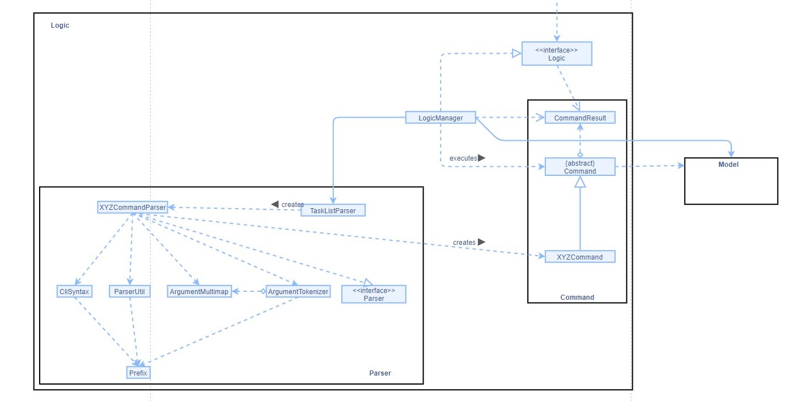
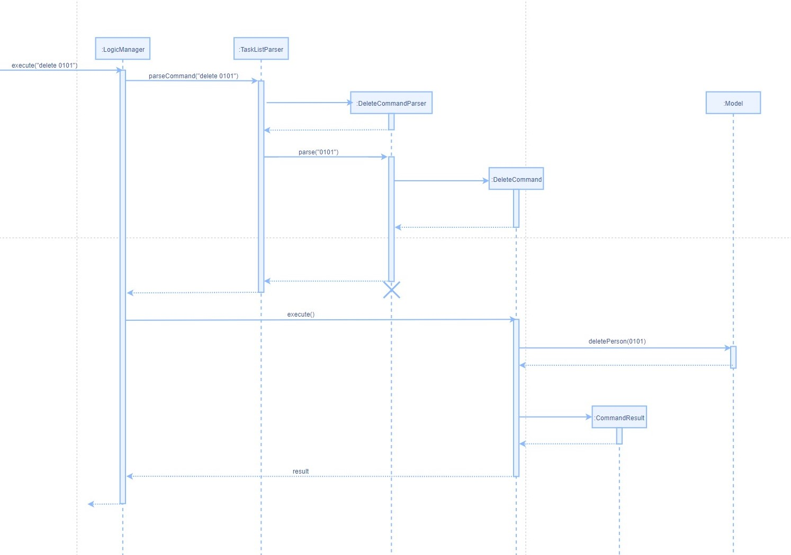
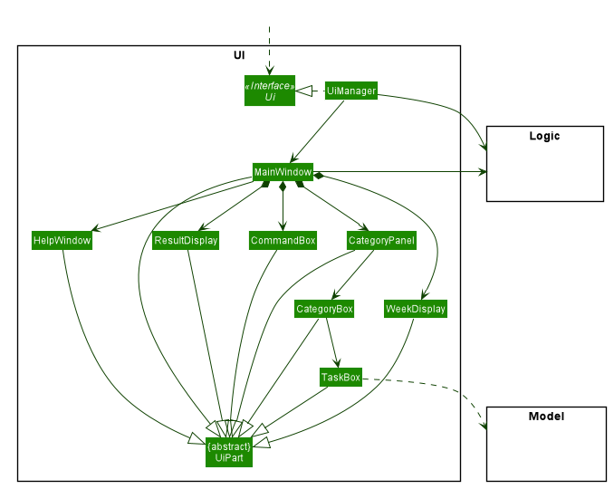
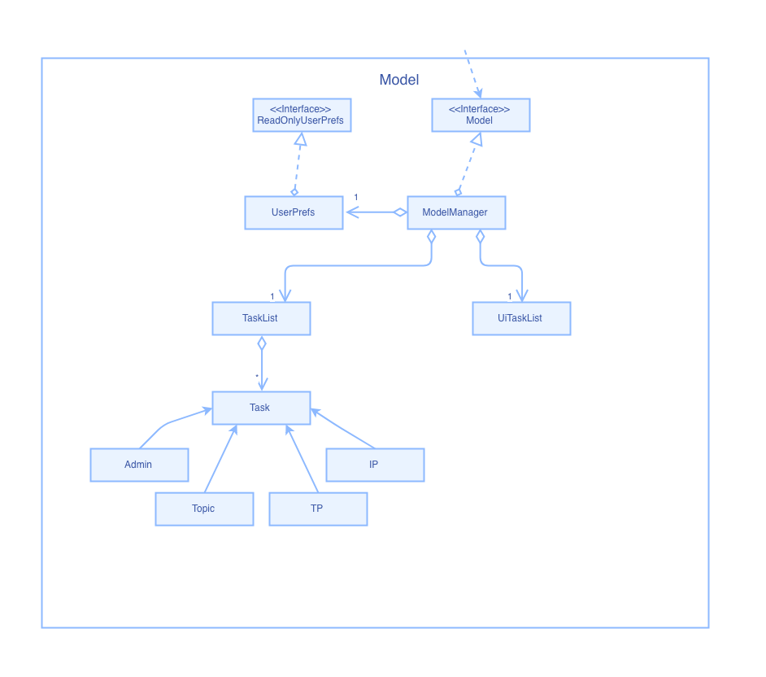
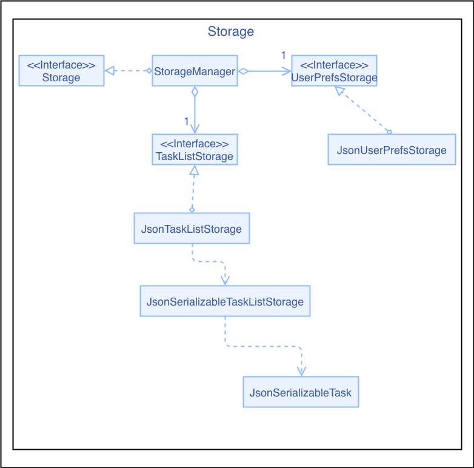

* Table of Contents
{:toc}

--------------------------------------------------------------------------------------------------------------------

# **Setting up, getting started**

Refer to the guide [_Setting up and getting started_](SettingUp.md).

--------------------------------------------------------------------------------------------------------------------

## **Design**

### Architecture

The ***Architecture Diagram*** given above explains the high-level design of the App. Given below is a quick overview of each component.

**`Main`** has two classes called [`Main`](https://github.com/AY2021S1-CS2103-T14-4/tp/blob/master/src/main/java/tp/acecs2103/Main.java) and [`MainApp`](https://github.com/AY2021S1-CS2103-T14-4/tp/blob/master/src/main/java/tp/acecs2103/MainApp.java). It is responsible for,
* At app launch: Initializes the components in the correct sequence, and connects them up with each other.
* At shut down: Shuts down the components and invokes cleanup methods where necessary.

[**`Commons`**](#common-classes) represents a collection of classes used by multiple other components.

The rest of the App consists of four components.

* [**`UI`**](#ui-component): The UI of the App.
* [**`Logic`**](#logic-component): The command executor.
* [**`Model`**](#model-component): Holds the data of the App in memory.
* [**`Storage`**](#storage-component): Reads data from, and writes data to, the hard disk.

Each of the four components,

* defines its *API* in an `interface` with the same name as the Component.
* exposes its functionality using a concrete `{Component Name}Manager` class (which implements the corresponding API `interface` mentioned in the previous point.

For example, the `Logic` component (see the class diagram given below) defines its API in the `Logic.java` interface and exposes its functionality using the `LogicManager.java` class which implements the `Logic` interface.

**How the architecture components interact with each other**

The *Sequence Diagram* below shows how the components interact with each other for the scenario where the user issues the command `delete 1`.

The sections below give more details of each component.

### UI component

**API** :
[`Ui.java`](https://github.com/AY2021S1-CS2103-T14-4/tp/blob/master/src/main/java/tp/acecs2103/ui/Ui.java)

The UI consists of a `MainWindow` that is made up of parts e.g.`CommandBox`, `ResultDisplay`, `CategoryPanel`, `WeekDisplay`, `HelpWindow` etc. All these, including the `MainWindow`, inherit from the abstract `UiPart` class.

The `UI` component uses JavaFx UI framework. The layout of these UI parts are defined in matching `.fxml` files that are in the `src/main/resources/view` folder. For example, the layout of the [`MainWindow`](https://github.com/se-edu/addressbook-level3/tree/master/src/main/java/seedu/address/ui/MainWindow.java) is specified in [`MainWindow.fxml`](https://github.com/se-edu/addressbook-level3/tree/master/src/main/resources/view/MainWindow.fxml)

The `UI` component,

* Executes user commands using the `Logic` component.
* Listens for changes to `Model` data so that the UI can be updated with the modified data.

### Logic component

**API** :
[`Logic.java`](https://github.com/AY2021S1-CS2103-T14-4/tp/blob/master/src/main/java/tp/acecs2103/logic/Logic.java)

1. `Logic` uses the `TaskListParser` class to parse the user command.
1. This results in a `Command` object which is executed by the `LogicManager`.
1. The command execution can affect the `Model` (e.g. adding a customised task).
1. The result of the command execution is encapsulated as a `CommandResult` object which is passed back to the `Ui`.
1. In addition, the `CommandResult` object can also instruct the `Ui` to perform certain actions, such as displaying help to the user.

Given below is the Sequence Diagram for interactions within the `Logic` component for the `execute("delete 0101")` API call.

### Model component

**API** : [`Model.java`](https://github.com/AY2021S1-CS2103-T14-4/tp/blob/master/src/main/java/tp/acecs2103/model/Model.java)

The `Model`,

* stores a `UserPref` object that represents the user’s preferences.
* stores the task list data.
* exposes an `UiTaskList` object containing four `ObservableList<Task>` that can be 'observed' e.g. the UI can be bound to this list so that the UI automatically updates when the data in the list change.
* does not depend on any of the other three components.

### Storage component

**API** : [`Storage.java`](https://github.com/AY2021S1-CS2103-T14-4/tp/blob/master/src/main/java/tp/acecs2103/storage/Storage.java)

The `Storage` component,
* can save `UserPref` objects in json format and read it back.
* can save the task list data in json format and read it back.

### Common classes

Classes used by multiple components are in the `tp.acecs2103.commons` package.

## **UI Enhancements**

### Task Box
**Description:**
Task Box is used to encapsulates a pre-defined or a customized task, which will be displayed in the category panel.
 
 
**Implementation:**
A task box contains the following fields:
+ index
+ week number
+ description
+ official deadline
+ customized deadline (if any)
+ remark (if any)

The constructor is called by Category panel and the data is obtained by passing in a task object from an observable task list.
 
 
**Why:**
Since there will be multiple tasks under a category panel, task box constructor should be called in category panel and use a default method in JavaFX to generate all the task boxes in one step.
 
 
**Other Considerations:**
Since the data in task box may change depending on the user input, therefore it should be able to check if need to update the content whenever data change happens. Therefore, it is necessary to implement update item method such that it can automatically check the update.

### Category Panel
**Description:**
Category panel is used to encapsulates a list of tasks which are of the same category as the header of the category panel.
 
 
**Implementation:**
Category panel contains the following fields:
+ category label
+ category view

Category panel will read in a category label and an observable task list from Ui Task List class. The category label will be passed into the constructor of category box which will generate the header of the panel. Every task object in the task list will be used to create to a corresponding task box.
 
 
**Why:**
Since a category panel should contains multiple tasks and a category box which indicate the category name, it is necessary to call the constructor of task box and pass in every task object to a corresponding task box. Besides, category label will be passed into the constructor of category box which will generate the header of the panel.
 
 
**Other Considerations:**
Since all the tasks are divided into four categories, and the structure for each panel is the same (header and tasks), there is only one category panel component needed. For styling, different colour and style will be implemented for different category panel.

### Category Box
**Description:**
A category box is a header box to indicate the category of the tasks below.
 
 
**Implementation:**
Category box contains the following field:
+ category label

Category box will just simply read in a string of category then create a corresponding category box.
 
 
**Why:**
Since there are four different categories, it is necessary to have header box to indicate the different categories.
 
 
**Other Considerations:**
The category field in the task box is not needed because category box can clearly show the category already.

### Command Box
**Description:**
User can enter commands in the command box.
 
 
**Implementation:**
Command box contains the following field:
+ input command

User command will be passed into input command filed and it will then pass to parser to finish subsequent procedures.
 
 
**Why:**
It is necessary to implement user command box such that the application will know what functionalities should be processed.
 
 
**Other Considerations:**
Since users are supposed to use keyboard only, submit button is replaced by click “Enter”.

### Week Display
**Description:**
Week display component will display the number of the week among all the filtered tasks if they are in the same week.
 
 
**Implementation:**
Week display contains the following field:
+ week number and date

Week display will receive the maximum and minimum week number among all the filtered tasks, and it will display the week and the corresponding date. Whenever the filtered tasks change, the component will do auto check and the week number should be changed correspondingly.
 
 
**Why:**
Although it is not essential, having this week display box can facilitate users to know the week that tasks belong to.
 
 
**Other Considerations:**
The text style should be different from others and it should be obvious.

### Message Window
**Description:**
After entering a command, the message window will tell users whether the command is executed successfully or not.
 
 
**Implementation:**
Message window contains the following field:
+ message text

Message window will accept a string of message from the parser which indicates the status of the command, and then display it at the bottom of the application. Besides, the displayed message should be refreshed and updated whenever a new command is entered.
 
 
**Why:**
In order to make sure the application is responsive for every command; it is necessary to add such a functionality so that users can clearly know weather the command is executed successfully or not instead of being unaware of a failed command.
 
 
**Other Considerations:**
The message should be clear and succinct that not occupy a large area.

## **Model Enhancements**

### UiTaskList
**Description:**
UiTaskList is a task list used for Ui display.
 
 
**Implementation:**
UiTaskList includes four sub task lists for `Admin`, `Topic`, `TP` and `IP`:
+ adminList
+ topicList
+ ipList
+ tpList

After running a command, UiTaskList will be refreshed to contain all the tasks satisfying current key condition.
 
 
**Why:**
It is to separate tasks which should be used for Ui display from TaskList used in command operation. This makes TaskList safer to avoid conflicts between Ui and Model.
 
 
**Other Considerations:**
The UiTaskList must be refreshed every time after the command is run in case there is any change for it.

--------------------------------------------------------------------------------------------------------------------

## **Documentation, logging, testing, configuration, dev-ops**

* [Documentation guide](Documentation.md)
* [Testing guide](Testing.md)
* [Logging guide](Logging.md)
* [Configuration guide](Configuration.md)
* [DevOps guide](DevOps.md)

--------------------------------------------------------------------------------------------------------------------

## **Appendix: Requirements**

### Product scope

**Target user profile**:

* Students who take CS2103 or CS2103/T
* prefer desktop apps over other types
* can type fast
* prefers typing to mouse interactions
* is reasonably comfortable using CLI apps due to prior experience with CLI apps

**Value proposition**:
Provide CS2103 and CS2103/T students with integrated timeline and checklists for weekly tasks in categories, and enable their customised managements of these tasks.

### User stories

Priorities: High (must have) - `* * *`, Medium (nice to have) - `* *`, Low (unlikely to have) - `*`

| Priority | As a …​                                    | I want to …​                        | So that I can…​                                                        |
| -------- | ------------------------------------------ | ----------------------------------- | ---------------------------------------------------------------------- |
| `* * *`  | new user                                   | learn about the commands            | understand how to use the features of the app|
| `* * *`  | user                                       | add a customised task               | track additional tasks beside the preloaded ones from the CS2103/T website
| `* * *`  | user                                       | edit a customised task              | include an update or correct a mistake
| `* * *`  | user                                       | delete a customised task            | remove a task that I do not want anymore
| `* * *`  | user                                       | search for tasks using a keyword    | find a specific task without reading through the whole task list
| `* * *`  | user                                       | search for tasks using category     | find tasks with similar categories
| `* * *`  | user                                       | add a customised deadline to a task | record when a task needs to be done according to my own schedule
| `* *`    | user                                       | list down tasks of a specific week  | check task history
| `* *`    | user                                       | mark an undone task as done         | know which task is finished clearly
| `* *`    | user                                       | mark a done task as undone          | correct wrongly marked task
| `*`      | user                                       | see the time bar of the semester    | the overall progress of the module

### Use cases

**Use case: UC01 - Check help information**

Actor: User

**MSS**

1.  User asks for help information
2.  Task manager shows link to the User Guide page

    Use case ends

**Use case: UC02 - Search for tasks**

Actor: User

**MSS**

1.  User asks for searching tasks with keyword
2.  Task manager lists search result

    Use case ends

**Extensions**

1a. User does not provide a keyword

    1a1. Task manager informs user to add a parameter
        Use case ends

2a. Searching for the keyword got no answer

    2a1.  Task manager informs user there is no result.
        Use case ends.

**Use case: UC03 - Check task list**

Actor: User

**MSS**

1.  User asks for list all tasks in a specific week
2.  Task manager lists all the tasks in the specific week

    Use case ends

**Extensions**

1a. User provides an invalid week number

    1a1.  Task manager informs the user the week number is incorrect
        Use case ends

1b. User does not provide week number

    1b1. Task manager informs the user to provide valid week number
        Use case ends

**Use case: UC04 - Add customised deadline to a task**

Actor: User

**MSS**

1.  User requests for adding a customised deadline to a task and provides task index and deadline
2.  Task manager add the deadline to the task and show overview of the task

    Use case ends

**Extensions**

1a.  User gives an invalid task index

    1a1.  Task manager informs user the task index is invalid
        Use case ends

1b.  User gives deadline in incorrect format

    1b1.  Task manager informs user the time format is incorrect and shows the correct format
        Use case ends

1c.  User does not provide complete parameters

    1c1.  Task manager informs user the command does not have complete parameters
        Use case ends

1d.  The task to be edited already has a deadline

    1d1.  Task manager updates the task with the new deadline and informs user the deadline of this task has been edited and shows the previous deadline
        Use case ends

**Use case: UC05 - Add a customised task**

Actor: User

**MSS**

1.  User requests for adding customised task and provides the necessary information
2.  Task manager adds the task and shows user an overview of task added

    Use case ends

**Extensions**

1a.  Information provided by user is not complete

    1a1.  Task manager informs user the correct format and asks for a new order
        Use case ends

1b.  Information provided by user is not in correct format

    1b1.  Task manager informs user the correct format and asks for a new order
        Use case ends

**Use case: UC06 - Edit a customised task**

Actor: User

**MSS**

1. User requests for editing a customised task and provides the necessary information
2. Task manager edit the task and update the UI

    Use case ends

**Extensions**

1a. Information provided by user is not complete

    1a1. Task manager informs the user to provide the complete information and informs the user the correct format
        Use case ends

1b. Information provided by the user is not in correct format

    1a1. Task manager informs the user to provide the complete information and informs the user the correct format
        Use case ends

**Use case: UC07 - Delete a customised task**

Actor: User

**MSS**

1.  User asks for deleting a customised task by giving task index
2.  Task manager deletes the task and informs user the task content deleted

    Use case ends

**Extensions**

1a.  User provides an invalid task index

    1a1. Task manager informs the user to provide a valid task index
        Use case ends

2a.  User does not provide task index

    2a1. Task manager informs the user to provide a valid task index
        Use case ends

3a. User attempts to delete a default task

    3a1. Task manager informs the user that only customised task can be deleted
        Use case ends

**Use case: UC08 - Mark a task as done/undone**

Actor: User

**MSS**

1. User asks for marking a task as done/undone by giving the task index
2. Task manager mark the task and update the done/undone status on the UI

    Use case ends

**Extensions**

1a. User provides an invalid task index

    1a1. Task manager informs the user to provide a valid task index
        Use case ends

2a. User does not provide task index

    2a1. Task manager informs the user to provide a valid task index
        Use case ends

3a. User attempts to mark a done task as done again or mark an undone task as undone again

    3a1. Task manager informs the user that the task has been marked already
        Use case ends

**Use case: UC09 - Go back to home page**

Actor: User

**MSS**

1. User asks for back to the default page(the task list of current week)
2. Task manager update UI to the list of current week

    Use case ends

**Use case: UC10 - Exit the task manager**

Actor: User

**MSS**

1.  User requests to exit from task manager
2.  Task manager shows goodbye words and stops program

    Use case ends.

**Extensions**

a. User clicks on exit button to exit

    a1. Task manager shows goodbye words and exits
         Use case ends.

**Use case: UC11 - Filter tasks**
         
Actor: User

**MSS**

1. User asks for filter tasks, provide keywords(done or pending), deadline type(official or customized), week number. And the provided parameters follow the requirement in UserGuide.
2. Task show tasks found and sort them based on the deadline of specified deadline type.

  Use code ends

**Extensions**

a. The provided parameters do not follow the requirement in UserGuide.

    a1. Task manager informs the user to follow the requirement and shows the correct examples.
            Use case ends    
         
         
 
         

### Non-Functional Requirements

1.  Should work on any _mainstream OS_ as long as it has Java `11` or above installed.
2.  Should be able to hold up to 1000 persons without a noticeable sluggishness in performance for typical usage.
3.  A user with above average typing speed for regular English text (i.e. not code, not system admin commands) should be able to accomplish most of the tasks faster using commands than using the mouse.
4.  A user who enrolled in CS2103/T should be quite familiar with default tasks every week, which are pre-loaded in the application.
5.  Modified data will be updated within 1 second.
6.  Should be able to contain up to 1000 customised tasks created by user.
7.  Help information and pre-load instructions will be displayed within 1 second.
8.  The application should load in 2 second when the number of customised tasks are within 1000.
9.  A user will be prohibited from editing the pre-load tasks or information.

### Glossary

* **Mainstream OS**: Windows, Linux, Unix, OS-X
* **Private contact detail**: A contact detail that is not meant to be shared with others
* **Customise tasks**: use `add` to add customised tasks into application which make it more personal

--------------------------------------------------------------------------------------------------------------------

## **Appendix: Instructions for manual testing**

Given below are instructions to test the app manually.

:information_source: **Note:** These instructions only provide a starting point for testers to work on;
testers are expected to do more *exploratory* testing.

### Launch and shutdown

1. Initial launch

   1. Download the jar file and copy into an empty folder

   1. Double-click the jar file Expected: Shows the GUI with a set of sample tasks. The window size may not be optimum.

1. Saving window preferences

   1. Resize the window to an optimum size. Move the window to a different location. Close the window.

   1. Re-launch the app by double-clicking the jar file. 
       Expected: The most recent window size and location is retained.

1. Shutdown
   1. Input `exit` in command line to save and exit.

### Adding a task

1. Adding a customised task into task list

	1. Prerequisites: Ensure that the index of adding task is not occupied.
	Provide necessary information, include: index, week number, description, deadline, category.
	The remark parameter is optional.

	1. Test case: 'add i/0109 w/1 d/update documentation c/2020-10-02 r/check tp dashboard a/Tp' 
		Expected: A task with:
			index: 0109
			week number: 1
			description: update documentation
			customised deadline: 2020-10-02
			remark: check tp dashboard
		is created under "Tp" category, and marked as undone.
		If your page is not switched to week 1, use 'list 1'  to switch to week 1

	2. Test case: 'add i/0110 w/1 d/Cyberpunk2077 c/2020-12-10 a/Ip' 
		Expected: A task with:
			index: 0110
			week number: 1
			description: Cyberpunk2077
			customised deadline: 2020-12-10
		is created under "Ip" category, and marked as undone.
		If your page is not switched to week 1, use 'list 1'  to switch to week 1

	3. Test case: 'add w/1 d/update documentation c/2020-10-02 r/check tp dashboard a/Tp' 
		Expected: No task is added. Error message will inform you that there is/are some necessary parameters missing.

	4. Test case: 'add i/01401 w/14 d/update documentation c/2020-10-02 r/check tp dashboard a/Tp' 
		Expected: No task is added. Error message will inform you that the index and week number is invalid.

	5. Test case: 'add i/0109 w/11 d/update documentation c/2020-10-02 r/check tp dashboard a/Tp' 
		Expected: No task is added. Error message will inform you that the index is not match to week number.

	6. Test case: 'add i/0109 w/1 d/update documentation c/2020-10-02 r/check tp dashboard a/Tp x/dummy' 
		Expected: No task is added. Error message will inform you that there are some unexpected parameters in the command.

	7. Test case: 'add i/0109 w/1 d/update documentation c/2020-19-75 r/check tp dashboard a/Tp' 
		Expected: No task is added. Error message will inform you that the deadline previded is an invalid date.

	8. Test case: 'add i/0109 w/1 d/update documentation c/2020-10-02 r/check tp dashboard a/Haha' 
		Expected: No task is added. Error message will inform you that the category you provided is unexisted.

### (Set) Deadline for tasks

Set customised deadline for a task

   1. Prerequisites: The task indicated should exist in the task list.
   1. Note that format for index follows this convention: 0 + week number + 2 digits, e.g. `0101`,`01011`,`01208`

   1. Test case: `deadline i/0701 c/2020-09-29` 
      Expected: Customised deadline for task indexed at 0701 is set. Success message shown in feedback box.

   1. Test case: `deadline i/0601 c/2020-09-29` 
      * Assuming this task is not overdue yet, i.e. the current time is before the official deadline of the task (2020-09-17).
      
      Expected: No customised deadline will be set. Error details will be shown in the status message, as task indexed at 0601 has an official deadline before 2020-09-29.

   1. Test case: `deadline i/0620 c/2020-09-29` 
      Expected: No customised deadline will be set. Error details will be shown in the status message, as task index provided is invalid.
   
   1. Other incorrect delete commands to try: `deadline`, `undone i/1`, `...` 
      Expected: Similar to previous. 
      
### Deleting a task

Deleting a customised task if it exists in the task list

   1. Prerequisites: Ensure that the task does exist in the task list by listing all tasks for the relevant week. 
   If there is no customised task created yet in the task list, add customised tasks using add command.
   For example, `add i/0109 w/1 d/update documentation c/2020-10-02 r/check tp dashboard a/Tp` to add
   a customized task with index 0109. 
   
   1. Note that format for index follows this convention: 0 + week number + 2 digits, e.g. `0101`,`01011`,`01208`

   1. Test case: `delete 0109` 
            Expected: Customised task indexed at 0109 is deleted from the task list. Success message shown.
            
   1. Test case: `delete 0101` 
      Expected: No task is deleted. Error details will be shown in the status message, as task indexed at 0101 is a default task that cannot be deleted.

   1. Test case: `delete 0` 
      Expected: No task is deleted. Error details shown in the status message as the task index is invalid. 
   
   1. Other incorrect delete commands to try: `delete`, `delete x`, `...` (where x is any string that does not follow the index format) 
      Expected: Similar to previous.

### Done a task

Mark a task as done if it is not done yet.

   1. Prerequisites: The task to be marked as done should be in pending status (not done yet). You can check the completion status by 
   observing the task color: red or grey for pending tasks, green for completed tasks.
   
   1. Note that format for index follows this convention: 0 + week number + 2 digits, e.g. `0101`,`01011`,`01208`

   1. Test case: `done 0101` 
      Expected: Pending task indexed at 0101 is marked as done correctly. Success message shown in feedback box.
       Task color changes from grey/red to green.
       * Note: if you type `done 0101` again, error message will be shown to remind you that this task has been marked as done.
            
   1. Test case: `done 0120` 
      Expected: No task is marked as done. Error details will be shown in the status message, as task indexed at 0120 does not exist.

   1. Test case: `done 0` 
      Expected: No task is marked as done. Error details shown in the status message as the task index is invalid. 
   
   1. Other incorrect delete commands to try: `done`, `done x`, `...` (where x is any string that does not follow the index format) 
      Expected: Similar to previous.

### Editing a task

1. Editing a task if it exists in the task list
    
    1. Prerequisite: Ensure that the task exits in the task list. One way you can check is by listing all tasks for the relevant week.
    If the task does not exist in the task list, you can add a customised task by using the add command.
    For example, `add i/0109 w/1 d/update documentation c/2020-10-02 r/check tp dashboard a/Tp` to add
    a customised task with index 0109.
    
    1. Test case: `edit i/0101 c/2020-09-01 r/updated remark`  
       Expected: Customised deadline and remark is updated for task indexed at 0101. Success message shown in feedback box.
    
    1. Test case: `edit i/0109 d/updated description r/updated remark`  
       Expected: Description, customised deadline and remark is updated for task indexed at 0109. Success message shown in feedback box.
    
    1. Test case: `edit i/0101 d/updated description r/updated remark`
       Expected: No task is edited. Error details will be shown in the status message as the task indexed at 0101 is a default task and the description cannot be edited.

     
### Filter task list

Filter task list according to certain criteria

   1. Test case: `filter k/done` 
      Expected: All completed tasks are displayed. Success message shown in feedback box. Note that no task will be displayed if none of the tasks in task list is done yet.

   1. Test case: `filter w/4 k/done` 
   Expected: All completed tasks in week 4 are displayed. Success message shown in feedback box.
   
   1. Test case: `filter k/pending l/official` 
      Expected: All pending tasks are displayed in ascending order of official deadline. Success message shown in feedback box.
      * Note: customised deadline will be used for comparison between tasks if certain tasks do not have official deadline
   
   1. Test case: `filter w/4 k/pending l/customised` 
      Expected: All pending tasks in week 4 are displayed in ascending order of customised deadline. Success message shown in feedback box.
      * Note: official deadline will be used for comparison between tasks if certain tasks do not have customised deadline
   
   1. Test case: `filter w/4` 
      Expected: Task list displayed will not be changed. Error details will be shown in the status message, as keyword for filter is not specified.
   
   1. Test case: `filter w/4 k/pending` 
      Expected: Task list displayed will not be changed. Error details will be shown in the status message, as type of deadline is a compulsory input for filtering pending tasks.
      
   1. Other incorrect delete commands to try: `filter`, `filter x`, `...` (for x being any irrelevant string)
      Expected: Similar to previous.       

### Finding a task
  
1. Finding a task by a keyword

    1. Test case: `find project`  
       Expected: Tasks with "project" in its description or remark will be listed. Success message shown in feedback box.

                     
### Undone a task

Mark a task as pending if it is marked as done.

   1. Prerequisites: The task to be marked as pending should be in done status. You can check the completion status by 
   observing the task color: red or grey for pending tasks, green for completed tasks.
   
   1. Note that format for index follows this convention: 0 + week number + 2 digits, e.g. `0101`,`01011`,`01208`

   1. Test case: `done 0101` `undone 0101` 
      Expected: 
      * for `done 0101`: Pending task indexed at 0101 is marked as done correctly. Success message shown in feedback box.
       Task color changes from grey/red to green.
      * for `undone 0101`: Done task indexed at 0101 is marked as pending correctly. Success message shown in feedback box.
                                      Task color changes from green to grey/red.
       * Note: if you type `undone 0101` again, error message will be shown to remind you that this task is not marked done yet.
            
   1. Test case: `undone 0120` 
      Expected: No task is marked as pending. Error details will be shown in the status message, as task indexed at 0120 does not exist.

   1. Test case: `undone 0` 
      Expected: No task is marked as pending. Error details shown in the status message as the task index is invalid. 
   
   1. Other incorrect delete commands to try: `undone`, `undone x`, `...` (where x is any string that does not follow the index format) 
      Expected: Similar to previous.      

### Home page

1. Switch current page to the task list of current week(home page).

	1. Test case: 'home' 
		Expected: Shown task list is switched to current week page.
		
### Help information

1. Getting help information

	1. Test case: 'help' 
		Expected: Get a link to the UserGuide page.          

### Listing tasks

1. Listing all tasks for a certain week.

    1. Test case: `list 6`  
       Expected: Tasks with week number 6 will be listed.
       
    1. Test case: `list 0`  
       Expected: No task is listed. Error details will be shown in the status message as the week number is not between 1 and 13.
    
### Saving data

1. Input `exit` in command line to save and exit.

## **Effort**

### Difficulty level

#### More entities:

* Compared with AB3 which has one panel for Person, there are four different kinds of tasks (Admin, Topic, Tp, Ip), and four panels to display the tasks with corresponding categories in Ace CS2103 / T.

#### More attributes:

* In AB3, each person object has 5 attributes: email, name, address, phone, and tags
* In Ace CS2103 / T, there are nine attributes in each task object: category, index, week number, description, official deadline, customized deadline, remark, status, and whether is a default task or not. 

#### More links between attributes:

* The nine attributes in our task objects are highly linked
* It makes the logic of processing each command much more complex as more conditions need to be checked and met, and changes to one attribute will inevitably affect other attributes
* Here are some examples: 
  * Index needs to be consistent with the week number
  * Default task cannot be deleted
  * Customised deadline cannot be set before official deadline if the task is not overdue
  * Description can only be edited for customised tasks, but not for default task
  * ...
* Due to the high amount of links between attributes, we need to consider more exceptions to handle
   
#### More commands:

* Compared with AB3, there are more commands in Ace CS2103/T
* Examples include:
   * deadline
   * done
   * undone
   * filter
   * ... 
* Because there are nine attributes in every object, commands are more easily to have bugs. When writing code, we need to be more careful and consider unintended consequences on other attributes and their compatibility.

#### More testing considerations:

* Some commands may have many fields (e.g. add, edit), so we need to ensure the absence of bug for every field. 
* We spent much time adding and improving our testing codes such that it can cover most possibilities.

### Challenges faced & effort required

#### Ui

* In this project, we are required to use JavaFX to design the Ui. However, none of us learned JavaFX before. Although some basic concepts are taught in the individual project, the knowledge needed for a team project is much more than that. 
* When designing the Ui, we need to learn from AB3 first and then think about how to adapt the techniques in our project. 
* Besides, we notice that for a particular styling, there are many ways to achieve it: it can be either implemented in .java class, .fxml file, or .css file, which adds many confusions. 
* Last but not least, although we looked into AB3 code to learn how it implements a certain feature, we abandoned the dark style used in AB3 and created our own light color style, which is also a huge challenge because we cannot use the code from AB3 directly.
Similarly, as all the tasks are divided into four categories for display, we need to include four category panels instead, which is different from AB3 so we cannot reuse its codes for UI.

#### Logic

* In this project, the logic part is the core of functions. 
* Implementation of each command requires the combination of different parts of logic. We need to understand user input, give proper commands, execute the commands and give correct feedback or exceptions. Jumping between different parts of the project is complex and debugging is long and painful. A lot of effort is needed for communications and collaborations between team members.

### Achievements of the project

* The final product of our team, a desktop task manager application used for keeping track of tasks for CS2103/T Software Engineering, is very relevant to students of CS2103/T. It may be extended in the future to become a truly useful tool to help future batches of this module.  
* During the process, we learned how to implement logic, storage, model, and Ui part for an application, as well as how these components interact with each other. 
* It teaches us how coding in the scale of an actual project places a strong emphasis on the integration between components on a higher abstraction level, which is different from coding in our previous programming modules such as CS1101S, CS2030S and CS2040, which focuses more on the writing of individual methods and classes. 
* Besides, we realized the importance of teamwork. Due to the close links between different parts of the codes, team members need to work together to offer help and work out the solution when any encounters difficulties.
* Although this project consumes a lot of time, it is quite meaningful because we gain much experience by working on an actual software engineering project and also make a group of trustful friends.

