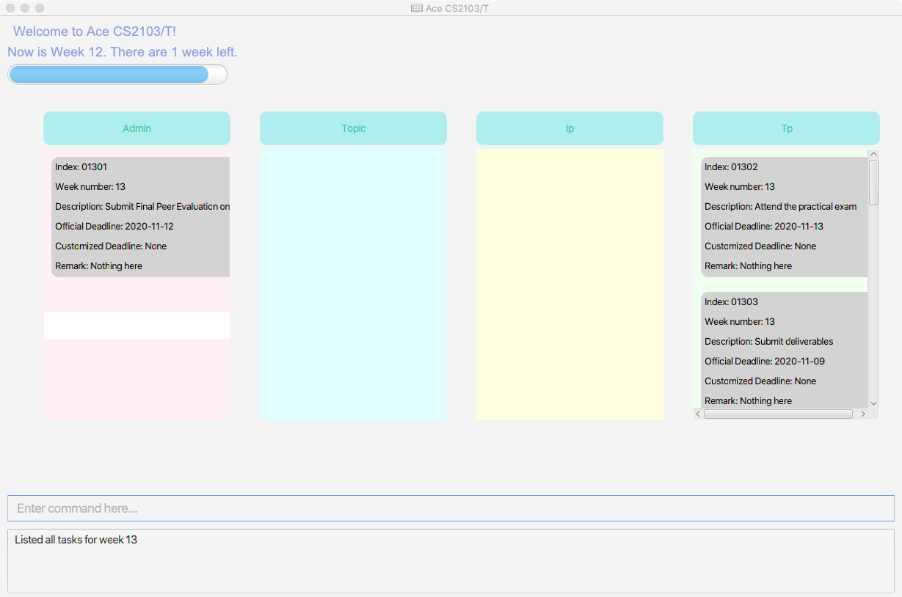
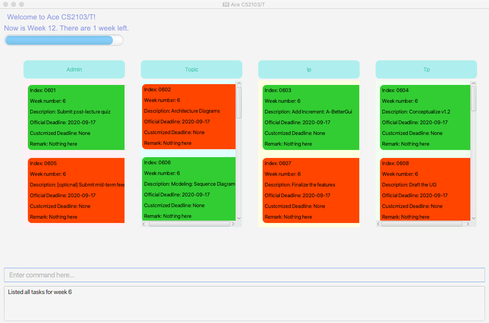

Ace CS2103/T is a **desktop app for managing task requirements of CS2103/T, optimized for use via Command Line Interface** (CLI) while still having the benefits of a Graphical User Interface (GUI). If you can type fast, Ace CS2103/T can get your learning tasks managed faster than traditional GUI apps.

* Table of Contents
{:toc}

--------------------------------------------------------------------------------------------------------------------

## Quick start

1. Ensure you have Java `11` or above installed in your Computer.

2. Copy the file to the folder you want to use as the _home folder_ for your Ace CS2103/T.

3. Double-click the file to start the app. The GUI similar to the below should appear in a few seconds. Note how the app contains some sample data. 
   
   
   
4. Type the command in the command box and press Enter to execute it. e.g. typing **`help`** and pressing Enter will get you the link for user guide. 
   Some example commands you can try:

   * **`list`**`6` : Lists all tasks for week 6.

   * **`deadline`**`i/0601 c/15-09-2020` : Adds a deadline 15-09-2020 to task indexed at 0601.

   * **`exit`** : Exits the app.

5. Refer to the [Features](#features) below for details of each command.

--------------------------------------------------------------------------------------------------------------------

## Features

**:information_source: Notes about the command format:** 

* Words in `UPPER_CASE` are the parameters to be supplied by the user. 
  e.g. in `list WEEK_NUMBER`, `WEEK_NUMBER` is a parameter which can be used as `list 6`.

* Items in square brackets are optional. 
  e.g `help [PARAMETER]` can be used as `help find` or as `help`.

### Viewing help: `help` *(Coming soon)*

Lists all available commands or format and usage for a specified command.

Format: `help [PARAMETER]`

List of PARAMETERs :

* No parameters: List all the supported commands for the task manager.
* get: `get PARAMETER`. Gets specified administrative information by parameters.
* find: `find KEYWORD`. Lists all tasks that contain the keyword.
* list: `list WEEK_NUMBER`. Lists all tasks in a specific week.
* deadline: `deadline i/TASK_NUMBER c/DEADLINE`. Adds a customized deadline to a preloaded task.
* add: `add d/DESCRIPTION c/DEADLINE r/REMARKS`. Adds a customized task in the task manager.
* delete: `delete TASK_NUMBER`. Deletes a customized task in the task manager.
* exit: `exit`. Exits the task manager.

### Viewing administrative information: `get` *(Coming soon)*

Gets specified administrative information by parameters.

Format: `get PARAMETER`

List of PARAMETERs :

* contact: Returns the email addresses of professors and TAs in charge of CS2103/T.
* faq: Returns preloaded FAQs on CS2103/T.
* overview: Returns the preloaded module overview.
* progress: Returns the links to iP and tP progress dashboards.
* setup: Returns the preloaded instructions about how to set up Github, IntelliJ and SourceTree.
* tp: Returns the team project Github link if it is available. Otherwise, user is prompted to key in the link.

### Finding relevant tasks: `find`

Lists all tasks that contain the keyword.

Format: `find KEYWORD`

* The KEYWORD is a letter string in the description and remark of tasks to be returned.
* Operates rough search in the task list.

Example:
* `find book`: Returns all tasks containing keyword “book” in their descriptions or remark.

### List tasks: `list`

Lists all tasks in a specific week.

Format: `list WEEK_NUMBER`

* The WEEK_NUMBER is a integer in range [1,13] representing a teaching week.

Example:
* `list 6`: Returns all tasks in teaching week 6.

### Deleting a customized task: `delete`

Deletes a customized task in the task manager.

Format: `delete TASK_INDEX`

* The task indexed at TASK_INDEX will be deleted.

Example:
* `delete 0601`: Task indexed at 0601 will be deleted.

### Adding a customized deadline: `deadline`

Adds a customized deadline to a preloaded task.

Format: `deadline i/TASK_INDEX c/DEADLINE`

* The task indexed at TASK_INDEX will be given a DEADLINE.
* The deadline should be given in the format: "YYYY-MM-DD"

Example:
* `deadline i/0601 c/2020-09-29`: Adds a customized deadline on 29th September 2020 to the first task of teaching week 6 which is indexed at TASK_NUMBER 0601.

### Adding a customized task: `add`

Adds a customized task in the task manager.

Format: `add i/INDEX w/WEEKNUMBER d/DESCRIPTION c/DEADLINE r/REMARK a/CATEGORY`

* The task with INDEX as index, WEEKNUMBER as week number, DESCRIPTION as description, DEADLINE as customised deadline, REMARK as remark, CATEGORY as the category will be added into task list.
* The INDEX, WEEKNUMBER, DESCRIPTION, DEADLINE and CATEGORY are compulsory, the REMARK is optional.

Example:
* `add i/0109 w/1 d/update documentation c/2020-10-02 r/check tp dashboard a/Tp`:
Task to update documentation with deadline set on 2020-10-02 of category tp with a remark to check tp dashboard is added to the task list.

### Mark a task as done/undone: `done` and `undone`

Marks a task in the task manager as done or undone.

Format of `done`: `done TASK_INDEX`

* The task at TASK_INDEX will be marked as done.

Format of `undone`: `undone TASK_INDEX`

* The task at TASK_INDEX will be marked as undone.

### Rank selected tasks base on deadline: `filter`

Filters the tasks based on selected condition and rank them by deadline.

Format 1: `filter k/KEYWORD w/WEEKNUMBER l/DEADLINETYPE`
Format 2: `filter k/KEYWORD l/DEADLINETYPE`
Format 3: `filter k/KEYWORD w/WEEKNUMBER`
Format 4: `filter k/KEYWORD`

* The `KEYWORD` can be "pending" or "done". The task manager will filter tasks based on the done status of tasks.
* The `WEEKNUMBER` can be used to specify which week the user select.
* The `DEADLINETYPE` can be "official" or "customized", which specify which deadline type the selected taskes should be ranked by.
* In Format 4, the KEYWORD can only be "done"
* In Format 1,2,3, the KEYWORD can only be "pending"

### Exiting the program : `exit`

Exits the program.

Format: `exit`

--------------------------------------------------------------------------------------------------------------------

## FAQ

**Q**: How do I transfer my data to another Computer? 
**A**: Install the app in the other computer and overwrite the empty data file it creates with the file that contains the data of your previous Ace CS2103/T home folder.

--------------------------------------------------------------------------------------------------------------------

## Command summary

Action | Format, Examples
--------|------------------
**Add** | `add d/DESCRIPTION c/DEADLINE r/REMARK a/CATEGORY`   e.g. 'add d/meeting c/2020-10-20 r/urgent a/Tp'
**Deadline** | `deadline i/TASK_NUMBER c/DEADLINE`   e.g., `deadline i/0601 c/2020-09-20`
**Delete** | `delete TASK_NUMBER`  e.g., `delete 0601`
**Edit** | `add d/DESCRIPTION c/DEADLINE r/REMARK a/CATEGORY`   e.g. 'add d/meeting c/2020-10-20 r/urgent a/Tp'
**Exit** | `exit`
**Find** | `find KEYWORD` e.g., `find book`  
**Help** | `help PARAMETER` 
**Get**  | `get PARAMETER`  
**List** | `list WEEK_NUMBER`  e.g., `list 6`  
